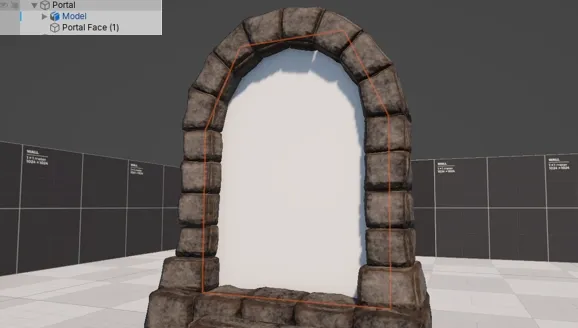
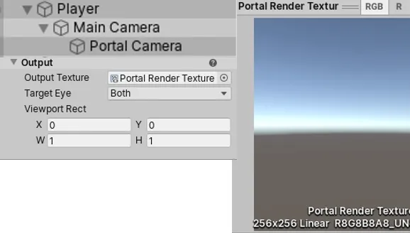
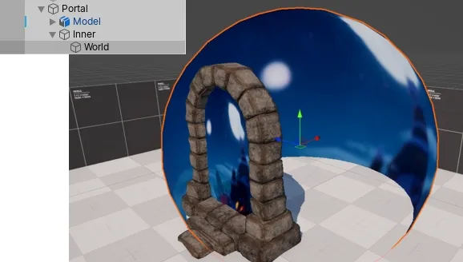
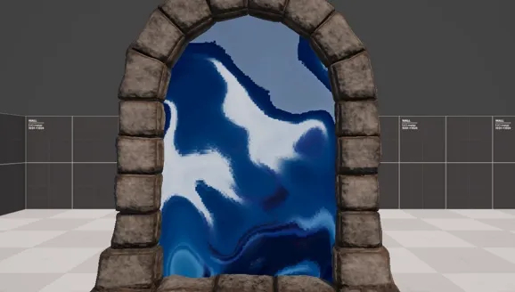




This post is based on a version of the shader I originally made in 2021.


I remember playing Spyro: Reignited Trilogy for the first time, and just being hit with a immense level of nostalgia - everything felt familiar, like going back to your childhood home, but it was fresh with a new coat of paint and few renovations here and there.

One thing stood out to me was the portals Spyro would use to travel between the worlds, they received a graphical upgrade, compared to the original PlayStation 1 games, that made them so much more interesting to look at - I could just watch them all day with the calm music in the background.

## Reference Breakdown

When re-creating effects from games, I like to start by breaking down my goal into more manageable sections. Looking at the reference video, we can identify few layers of effects we'll need to tackle to achieve the same effect:

- **Background**: Background appears to have depth, as depending on the viewing angle we can see different parts of it.
- **Blur**: Background seems to have some blur applied to it, as it isn't super sharp when looking through the portal.
- **Distortion**: Background is constantly being distorted by an animated effect.
- **Edge Glow**: There is a soft glow around the edge of the 'inner' part of the portal.

Now that we know what we need to do, let's tackle each layer one at a time.

## Scene Setup

Before starting on the shader, I have setup a simple testing scene - I have a portal model which I grabbed from [Sketchfab](https://sketchfab.com/3d-models/ancient-portal-frame-934bbd85eb4041128a1fa4cde8ac0ea9), and I removed the chains, torches, leafs, and the inner part as we'll be handling that ourselves.

I created a simple flat plane to fill the middle making sure it expands into the actual bricks of the portal so we don't get any gaps.

Next, we want to create a new sorting layer called "PortalWorld" - this layer will contain the worlds that we will see through the portal, allowing us to disable them from being rendered on the main camera.

Finally, we want to create a second camera called "Portal Camera", and parent it to the main camera (remember to reset the portal camera transform). In my case, the main camera is parented to the player, so when I navigate the level both cameras will follow.

In the portal camera, we want to tweak the `Output Texture` field (under **Output Settings**) and assign a new render texture (`Create > Rendering > Render Texture`). We will only need one render texture for all portals.



> [!INFO]
> Project, and source code with assets available in GitHub repository below.

If everything has been setup correctly, when we run Unity we should see the render texture update in inspector.



## Background

The background can be split into two sections: the background shown on the portal inner part, and the world rendered to the render texture. We will be using the render texture as the main texture in our shader to create the background, and we will be using creating a world that is seen inside of the portal on a separate layer.

### World "Inside" Portal

I first started with creating a sphere and a unlit URP material, and I assigned the newly created material to our sphere. We need to make sure to set the **Render Face** option to `Back` as we want to see the inside of the sphere (otherwise it would appear invisible).

Next I made the sphere as the child of the portal inner, and I moved it slightly off center behind the portal (in the direction players would be looking at it).



For the background image, I went into the Fracture Hills level and I grabbed a ultra-wide screenshot of the world. Rather than blurring the image in real-time in the shader, I have applied gaussian blur to the background using image-editing software. I then applied the texture to our sphere material.

> [!NOTE]
> We could apply the blur in-shader, but I don't think the quality difference is noticeable enough to justify it - additionally, when we have multiple portals in the world, that will be quite few calculations for something we can have baked-in.

### Shader Background

Now that we have our world sphere, we can start working on the portal inner shader - I started off by creating a URP unlit shader, and cleaning it up a little only leaving things we will need, and fragment function sampling our main texture.

<details>
<summary>Shader Code</summary>

```hlsl
Shader "DP/PortalInner"
{
    Properties
    {
        [MainTexture] _BaseMap("Base Map", 2D) = "white" {}
    }

    SubShader
    {
        Tags {
            "RenderType" = "Opaque"
            "RenderPipeline" = "UniversalPipeline"
        }

        Pass
        {
            HLSLPROGRAM
            #pragma vertex vert
            #pragma fragment frag

            #include "Packages/com.unity.render-pipelines.universal/ShaderLibrary/Core.hlsl"

            struct Attributes
            {
                float4 positionOS : POSITION;
                float2 uv : TEXCOORD0;
            };

            struct Varyings
            {
                float4 positionHCS : SV_POSITION;
                float2 uv : TEXCOORD0;
            };

            TEXTURE2D(_BaseMap);
            SAMPLER(sampler_BaseMap);
            
            CBUFFER_START(UnityPerMaterial)
                float4 _BaseMap_ST;
            CBUFFER_END

            Varyings vert(Attributes IN)
            {
                Varyings OUT;
            
                OUT.positionHCS = TransformObjectToHClip(
                    IN.positionOS.xyz
                );
                
                OUT.uv = TRANSFORM_TEX(
                    IN.uv,
                    _BaseMap
                );

                return OUT;
            }

            half4 frag(Varyings IN) : SV_Target
            {
                half4 color = SAMPLE_TEXTURE2D(
                    _BaseMap,
                    sampler_BaseMap,
                    IN.uv
                );

                return color;
            }
            ENDHLSL
        }
    }
}
```
</details>

If you create a material, which uses our new shader, assign it to the portal inner mesh and set the render texture as main texture you will notice something strange when playing the game - the background is moving with our player!



#### UV Mapping

This is expected, albeit not correct, behavior. The reason why we are seeing this, is because the second camera is moving with the player, and what we are displaying is the output from that camera; so as we move closer to the portal, the background becomes larger and as we move away, the background becomes smaller.

We can tackle this problem by applying some clever math. This was a new area to me, but thankfully Sebastian Lague has made an excellent tutorial on portals, and the texture mapping is also covered there.

> [!QUOTE] [Sebastian Lague](https://youtu.be/cWpFZbjtSQg?si=4QZnsFGgEinxV8yZ&t=189)
> "This [the texture mapping] is like taking the view texture, and just cutting out the region that overlaps with the screen of the portal."

Sebastian explains this approach really well in the video, with visual examples, so I highly recommend giving at least the timestamped part a watch.

Instead of using the object UVs, we will use screen position of the mesh vertices as our UVs; this will result in the background staying in place.

In order to achieve this effect, we will need to provide the screen position to the fragment shader; luckily Unity has a built in function that can handle this for us.

```hlsl
struct Varyings
{
    // ...

    float4 screenPos : TEXCOORD1;
}

Varyings vert(Attributes IN)
{
    // ...

    OUT.screenPos = ComputeScreenPos(OUT.positionHCS);

    return OUT;
}
```

Now we can calculate our screen space UVs by dividing the `x` and `y` components by `w` - this is something that Sebastian also covers in the video. This is required in order to correctly apply perspective distortion (the further the object is from camera, the higher the value) to our image. 

```hlsl {hl_lines=[3, 8]}
half4 frag(Varyings IN) : SV_Target
{
    float2 screenSpaceUV = IN.screenPos.xy / IN.screenPos.w;

    half4 color = SAMPLE_TEXTURE2D(
        _BaseMap,
        sampler_BaseMap,
        screenSpaceUV
    );

    return color;
}
```



## Distortion

Now that we have our background rendering correctly, we can tackle something a little easier. As previously noted, the background in Spyro's version of the portal has a small distortion that is constantly animating.

### Sampling Noise

We can achieve this easily by sampling a noise texture, and modifying the UVs we have just calculated by adding the noise on top of the UVs. Let's add a new property to our shader called `DistortMap`, calculate the UVs for it in vertex shader, and sample it using the new UVs in fragment shader.

```hlsl
// Inside Properties object
_DistortMap("Distortion Texture", 2D) = "white" {}
// ---

struct Attributes
{
    // ...

    float2 uvDistort : TEXCOORD2;
};

struct Varyings
{
    // ...

    float2 uvDistort : TEXCOORD2;
};


TEXTURE2D(_DistortMap);
SAMPLER(sampler_DistortMap);

CBUFFER_START(UnityPerMaterial)
    // ...
    float4 _DistortMap_ST;
CBUFFER_END

Varyings vert(Attributes IN)
{
    // ...

    OUT.uvDistort = TRANSFORM_TEX(
        IN.uvDistort,
        _DistortMap
    );

    // ...
}

half4 frag(Varyings IN) : SV_Target
{
    float distortTexture = SAMPLE_TEXTURE2D(
        _DistortMap,
        sampler_DistortMap,
        IN.uvDistort
    );

    // ...
}
```

With the texture sampled, we now have a static noise we can use in our fragment function. In order for it to affect the UVs, we can simply add it to the screen position UVs we have calculated earlier - we will need the screen space UVs unaffected later, so let's cache it into a new variable called `backgroundUV`.

```hlsl {hl_lines=[1, 2, 7]}
float2 backgroundUV = screenSpaceUV;
backgroundUV += distortionTexture;

half4 color = SAMPLE_TEXTURE2D(
    _BaseMap,
    sampler_BaseMap,
    backgroundUV
);
```



As you have probably noticed, the distortion effect is quite strong. By creating a new property called `_DistortStrength` we can manipulate the strength of the sampled noise texture, and lessen the impact of the noise on the UVs.

```hlsl {hl_lines=[6]}
float distortTexture = SAMPLE_TEXTURE2D(
    _DistortMap,
    sampler_DistortMap,
    IN.uvDistort
);
distortionTexture *= _DistortStrength;
```

### Animating Noise

Now that we noise affecting our background, and we can control how strong the noise is, we can actually tackle animating the noise texture - this is actually quite straightforward.

Inside of our vertex shader where we are sampling our distort texture UVs, we can modify them by using the built in Unity `_Time.x` property. I first create a vector 2 property called `_DistortAnimationVector`, we can use that to specify which direction we want the UVs to animate, and also I create another property called `_DistortAnimationSpeed`.

```hlsl
Properties
{
    // ...

    // In ShaderLab the vector length only applies in 
    //  inspector, otherwise it is still treated as x/y/z/w.
    _DistortAnimationVector("Animation Direction", vector, 2) = (0, 1, 0, 0)
    _DistortAnimationSpeed("Animation Speed", float) = 2
}
```

We can use those two properties in our vertex shader, like so:

```hlsl
float2 uvDistort = TRANSFORM_TEX(
    IN.uvDistort,
    _DistortMap
);

float2 distortOffset = _DistortAnimationVector.xy;
distortOffset *= _Time.x * _DistortAnimationSpeed;

OUT.uvDistort = uvDistort - distortOffset;
```



## Edge Glow

Would you look at that, we're on the last step of the shader! The final effect we have left is the glow around the edge of the inner part of the portal. This is where we will use those screen space UVs again, as we will be creating the glow using a depth texture.

### Depth Texture?

You might ask yourself, what is a depth texture? Or actually.. what is depth? Well, in computer graphics depth has a similar meaning as it would in every day life. 

Depth describes how far away the fragment (potential pixel) is from the camera; if we visualized the depth, elements further away would appear white and elements closed to camera would appear darker.